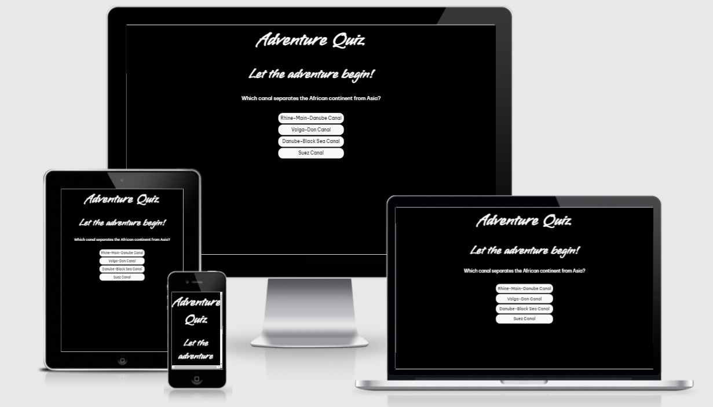

<h1>Adventure Quiz</h1>

View the live project here: [Adventure Quiz](https://vannesha2021.github.io/adventurequiz/)

<h2>Introduction</h2>
With this World Quiz, users can test themselves on their global geographic knowledge. Users are asked 10 quiz questions, and are  able to select an answer from a multiple-choice list. When a user completes the quiz, they are informed of their score.

<h2>Built with</h2>

- JavaScipt

- HTML

- CSS

<h2>Timeline</h2>

- This project began with generating the concept of the world geography quiz, and the structure thereof - i.e. multiple-choice answers, ability to provide a final score, and immediate per-question feedback. Once the structure was conceived and question/answer sets had been drafted, I then proceded to create the wireframes to assist in the efficient development of the quiz. The links to the wireframes are provided below:
- The image below is the wireframe which was used to design the quiz.

<h2>User Experience (UX)</h2>
Upon arriving, the quiz page is engaging and quickly understandable. Users are encouraged to engage with the quiz as the first question is shown immediately, thus removing any friction to the user commencing the quiz. The quiz fonts are chosen for their readability, and questions are highlighted as they are hovered over. Users receive immediate feedback post-selection if they have been successful or otherwise upon answering each question. At the conclusion of the quiz, users are provided with their final score so that they are left encouraged to try again if they have not been fully succcessful this visit. 

<h2>Design</h2>

- Colour Scheme

The colour scheme selected for this quiz was specifically chosen for readability and so as to reduce the possibility of distraction, and enhance user focus while users are engaging with the quiz. 

- Typography

Vujahday Script was chosen for text within the H1 and H2 tags to give a relaxed, engaging look to the quiz. Meanwhile, Be Vietnam Pro was used for the quiz questions and answers, in order to ensure readability and clarity.

- Imagery

No imagery exists within the quiz.

<h2>Features</h2>

Responsive to all device sizes.

Engaging elements.

Calculates final score for users.

<h2>Technologies Used</h2>

- JavaScript

- HTML5

- CSS 3

- GitPod

<h2>Frameworks, Libraries and Programs Used</h2>

- Hover.css

Hover CSS was used on when in question selection to provide further confirmation on the users selection of answers.

- Google Fonts

Google fonts were used to import the Vujahday Script and the Be Vietnam Pro which was used throughout the project.

- Git

GIT was used for version control and utilising the Gitpod terminal to commit to Git and push to Github.

- GitHub

Github is used to store the projects code after being pushed from Git.

- Lucidchart

Lucidchart was used to create my wireframes at the start of the project.

- Slack Channel

Slack was used to communicate with other coders, and tutors to resolve issues which I was facing with the project.

<h2>Testings</h2>
The W3C Markup Validator and W3C CSS Validator Services were used to validate every page of the project to ensure there were no syntax errors in the project.

[W3C Markup Validator- HTML](https://validator.w3.org/) - [Results](https://validator.w3.org/nu/?doc=https%3A%2F%2Fvannesha2021.github.io%2Fadventurequiz%2Findex.html)

[W3C Markup Validator - CSS](https://validator.w3.org/) - [Results](https://jigsaw.w3.org/css-validator/validator?uri=https%3A%2F%2Fvannesha2021.github.io%2Fadventurequiz%2Fassets%2Fcss%2Fstyle.css
)

[jshint Validator - JavaScipt](https://jshint.com/)

Image result is shown below :

In addition to that, I was also usIng the console to ensure that there were no errors in the whole duration of the project.

<h2>Accessibility</h2>

Scored a minimum of 87%

<h2>Bugs</h2>
There were no known bugs at the time of final deployment.

<h2>Issues Faced during the project</h2>

- Difficulty in getting understanding JavaScipt in a short period of time.

- Trying to make the score addition work at the end of the quiz.

- My initial idea was to create multiple quiz in one page but due to time constraint, the page consist of 1 quiz.

<h2>Credits and references</h2>

- Traversy Media from YouTube
- DaveHorrocks_5P from Slack assisted me with codes for this project.
- code-boxx.com
- Web Dev Simplified
- w3schools

<h2>Deployment</h2>
The project has been developed using Gitpod and GitHub. The project was regularly commited to GitHub during the initial development phase.

The site was deployed to GitHub pages.

The steps to deploy are as follows:
In the GitHub repository, navigate to the Settings tab.
On the left menu list, select Pages.
In the source section drop-down menu, select the Main Branch and click Save.
Upon successful save, the Github Pages section will display a message to indicate that the site is ready to be published at https://vannesha2021.github.io/adventurequiz/.

<h2>Project walkthrough</h2>

- Quiz question page

- Answer feedback browser popup

- Result page

<h2>Contact details</h2>

* Vannesha Andrew - vannesha90@gmail.com
